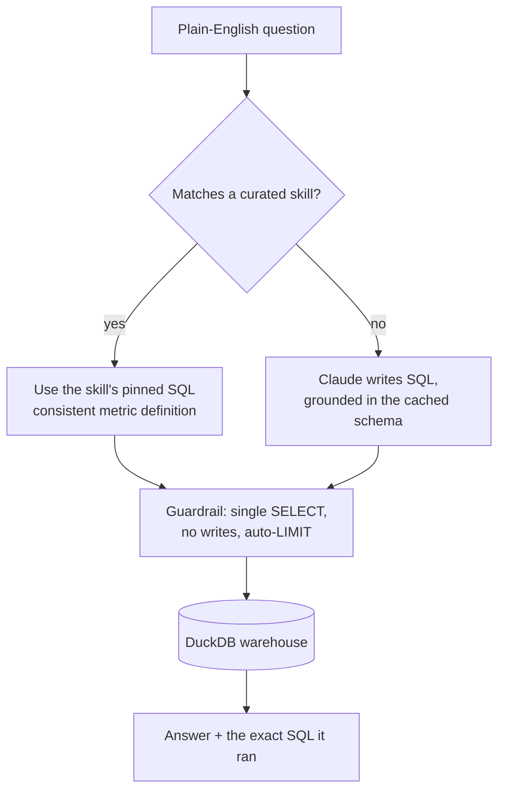

# Ask the Warehouse

A natural-language SQL copilot over a DuckDB analytics warehouse. Ask a question
in plain English; it grounds an LLM in the live schema, generates **read-only**
SQL, runs it, and returns the answer **with the exact SQL it ran**.


> Portfolio project. The warehouse is **synthetic** (built by `scripts/build_demo_db.py`)
> and contains no real information. The copilot runs fully offline for the example
> questions; an API key unlocks open-ended ones.

## What it demonstrates

- **LLM application development** — translating questions to SQL, grounded in the
  real schema, not hallucinated columns
- **A reusable skill framework** — curated metrics with pinned SQL, so a definition
  like "conversion rate" is always computed the same way (`ask/skills.py`)
- **System-prompt & context management** — the schema is built once and sent in a
  **cached** system prompt, reused across calls
- **Guardrails** — answers are constrained to a single read-only `SELECT`, validated
  before execution, run on a `read_only` connection, and auto-limited
- **Tested** — 18 passing tests covering the guardrail and the copilot flow

## How it works



Curated **skills** answer the common, well-defined questions the same way every
time. Anything outside them falls through to the model, which only ever sees the
real table and column names. Either path goes through the same read-only guardrail.

## Two modes

| Mode | When | What you get |
|---|---|---|
| **Offline** (default) | no API key | the curated skills answer the example questions |
| **Live** | `ANTHROPIC_API_KEY` set | Claude also answers open-ended questions |

## Quickstart

```bash
git clone https://github.com/bpcrandell/ask-the-warehouse.git
cd ask-the-warehouse
pip install -r requirements.txt

python scripts/build_demo_db.py            # build the synthetic warehouse
python -m ask "what is the overall conversion rate?"
```

```text
Q: what is the overall conversion rate?
[answered via skill:overall_funnel]

select count(*) as leads, ... from fct_funnel limit 200

leads | quotes | policies | lead_to_policy_rate
-----------------------------------------------
4000  | 2216   | 895      | 0.224
```

Web UI: `streamlit run app.py`. SQL-only: add `--sql-only`.

## Live mode (open-ended questions)

```bash
export ANTHROPIC_API_KEY=sk-ant-...      # Windows: set ANTHROPIC_API_KEY=...
python -m ask "average bound premium by region for QR-code leads"
```

The model is given the schema in a cached system prompt and must return a single
read-only `SELECT`; the same guardrail then validates it before it runs.

## Example questions (work offline)

- "What is the overall conversion rate?"
- "Show me conversion by source."
- "Who are the top performing dealers?"
- "Break it down by region."
- "How much bound premium is there?"

## Guardrails (`ask/db.py`)

- Single statement only (no stacked queries)
- `SELECT` / `WITH` only; write and DDL keywords are rejected
- Connection opened `read_only=True` — defense in depth
- A `LIMIT` is enforced if the query doesn't set one

## Project structure

```
ask-the-warehouse/
├── ask/
│   ├── db.py          # read-only DuckDB access + query guardrail
│   ├── schema.py      # live schema -> grounding context
│   ├── skills.py      # reusable curated-metric framework
│   ├── llm.py         # Anthropic backend + offline stub
│   ├── copilot.py     # orchestration
│   ├── cli.py         # python -m ask "..."
│   └── demo_data.py   # synthetic warehouse generator
├── app.py             # Streamlit UI
├── scripts/build_demo_db.py
└── tests/             # guardrail + copilot tests (pytest)
```

## Run the tests

```bash
python -m pytest -q      # 18 passed
```

## Built by

**Brandon Crandell** — Analytics Engineer · AI / LLM Application Developer · Full-Stack Data
[LinkedIn](https://www.linkedin.com/in/brandoncrandell) · [dealer-analytics-warehouse](https://github.com/bpcrandell/dealer-analytics-warehouse) (the dbt warehouse this pattern sits on)
